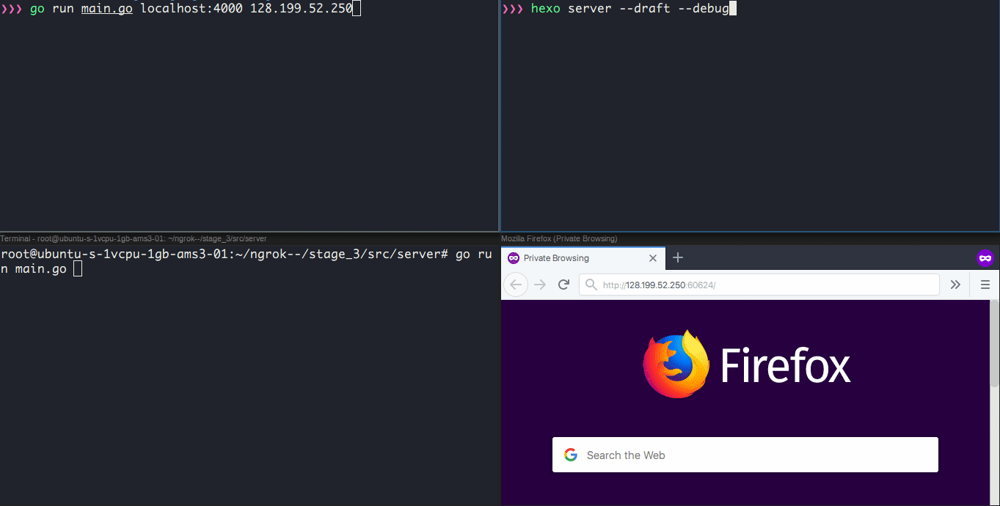

# ngrok--

[ngrok](https://github.com/inconshreveable/ngrok) but worse!



This repository is meant to explain how ngrok does its magic of punching through Firewall/NAT by implementing a clone in a step-by-step fashion.

### How ngrok-- works

[ngrok](https://github.com/inconshreveable/ngrok/blob/master/docs/DEVELOPMENT.md) provides a succint explanation of how it works on high level which we'll be using as our reference.

For ngrok-- though, we'll be cutting corners a bit but the core technique of bypassing Firewall/NAT will be implemented, albeit differently. It's the thought that counts right?

Traffic flow should resemble the "diagram" below:

```
                             5
     +-------------------------------------------------+
     |                                                 |
     |             +------------------+                |
     |             |         4        |                |
     |             |                  |                |
     |             |             +----|----------------|------+
     v             v             |    v                v      |
  +----+   2   +------+          | +------+       +---------+ |
  |user|------>|server|          | |client|<----->|local app| |
  +----+       +------+          | +------+   4   +---------+ |
                   ^             |    ^                       |
                   |             +----|-----------------------+
                   |         1        |              Firewall/
                   +------------------+              NAT
                             3
```

1) Client establishes a control connection with the server
2) Server waits for a public user to connect
3) On user connect, send a proxy create command to client
4) Client establishes a proxy connection with the server and a private connection with the local app
5) Server and client pipes all the connection together forming a logical connection between the user and the local app

### Scope and Limitations

We'll only be considering a single tunnel of HTTP traffic

### Stages

* [Stage 0](stage_0/README.md) - Proof of concept implementation of a simple client-side proxy
* [Stage 1](stage_1/README.md) - Server, client and control connection implementation
* [Stage 2](stage_2/README.md) - Implementing public and proxy connection
* [Stage 3](stage_3/README.md) - Implementing the private connection
