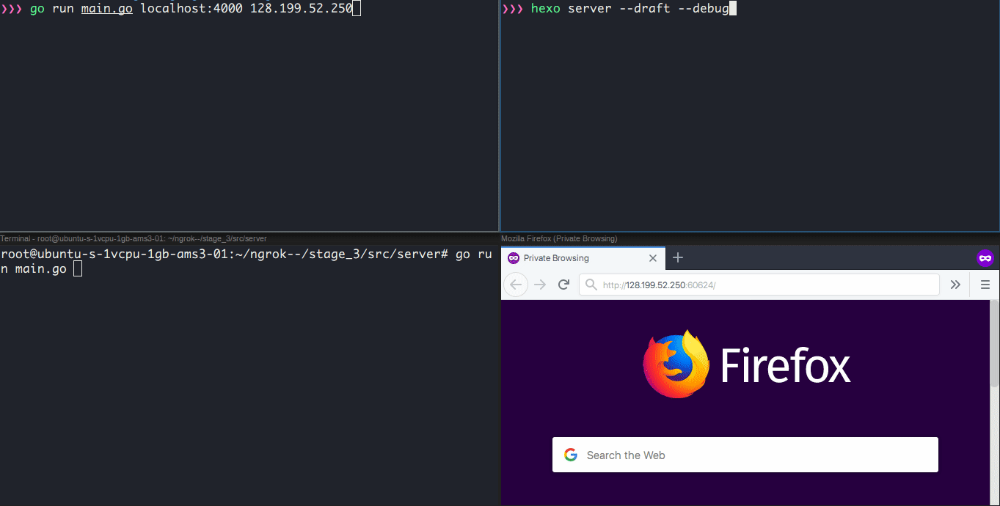

## Stage 3
For the final stage, we'll properly pipe traffic from the proxy connection to a private connection handled by the client to the localhost server. The flow should now be:

```
                             2
     +-------------------------------------------------+
     |                                                 |
     |             +------------------+                |
     |             |         1        |                |
     |             |                  |                |
     |             |             +----|----------------|------+
     v             v             |    v                v      |
  +----+       +------+          | +------+   1   +---------+ |
  |user|------>|server|          | |client|<----->|local app| |
  +----+       +------+          | +------+       +---------+ |
                   ^             |    ^                       |
                   |             +----|-----------------------+
                   |                  |              Firewall/
                   +------------------+              NAT
```

1) [Client] On proxy creation command, open both a proxy connection to the server and a private connection to the local app server.

2) [Client] On new proxy and private connection, pipe traffic between the two to form the logical connection between the user and the local app server.

### Verification
To verify that everything works as expected, spin up an instance on your favorite cloud provider and run the server code there.

On your machine, run a local app and the client code using `go run main.go localhost:<port of your app> <IP of your server>`. Visiting `http://<Server IP>:60624` should display your local app!



### Further Work
* Server doesn't actively check the control connection. Implementing hearbeats would be good.


[Previous](../stage_2/README.md) <<>> [Home](../README.md)
